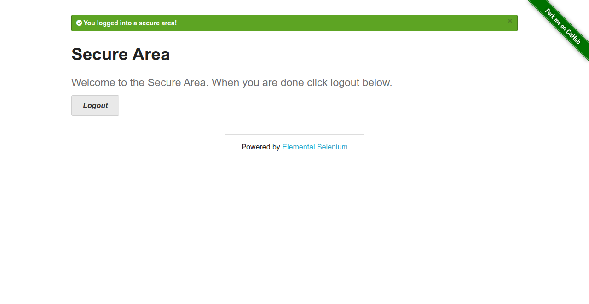
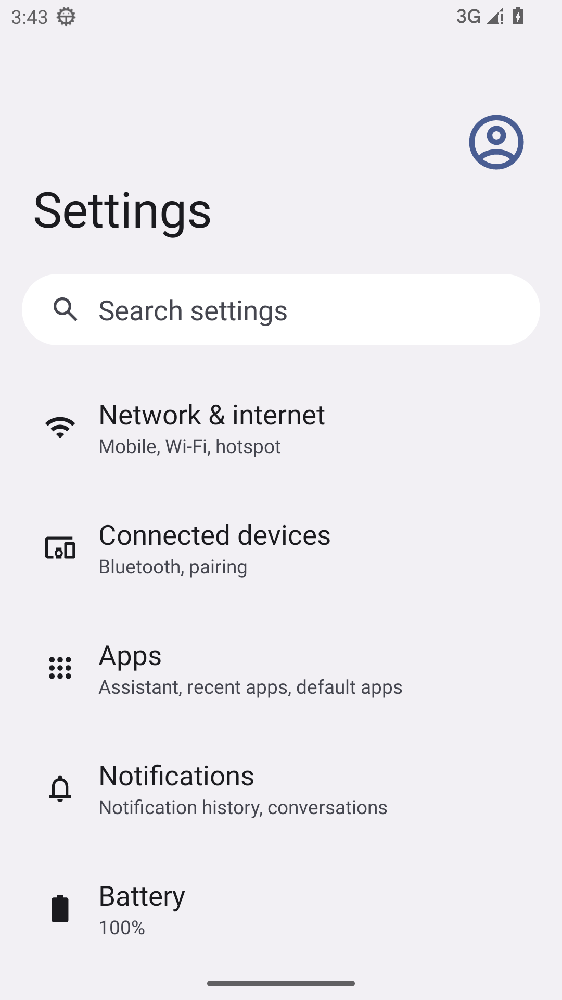

---

# 🧪 Client Automation Tests (Web + Mobile)

This project demonstrates **end-to-end client automation testing** for both **Web** (Selenium + Pytest) and **Mobile** (Appium + Android Emulator).  

---

## 🚀 Features

### 🌐 Web Automation (Selenium + Pytest)
Automated tests against [the-internet.herokuapp.com](https://the-internet.herokuapp.com):
- ✅ **Login Flow** → handles valid & invalid login  
- ✅ **Form Validation** → validates email form submission  
- ✅ **File Upload** → uploads and verifies a file  

### 📱 Mobile Automation (Appium + Emulator)
Automated Android test cases:
- ✅ Launches and validates **Settings app** on emulator  
- ✅ Runs using **Appium v3** with **UiAutomator2 driver**  
- ✅ Captures emulator screenshots for evidence  

---

## 📂 Project Structure

```

client-automation-tests/
├── conftest.py              # Shared fixtures (Selenium + Appium) + screenshots
├── tests/
│   ├── test_login.py        # Web: login flow
│   ├── test_form_validation.py  # Web: form validation
│   ├── test_file_upload.py  # Web: file upload
│   └── test_mobile.py       # Mobile: Settings app test
├── screenshots/             # Saved screenshots from test runs
├── requirements.txt         # Python dependencies
├── pytest.ini               # Pytest configuration
└── README.md

````

---

## ⚙️ Setup Instructions

### 1️⃣ Clone Repository
```bash
git clone https://github.com/hasanulkabir-md/client-automation-tests.git
cd client-automation-tests
````

### 2️⃣ Create Virtual Environment

```bash
python3 -m venv venv
source venv/bin/activate   # Linux/Mac
venv\Scripts\activate      # Windows
```

### 3️⃣ Install Dependencies

```bash
pip install -r requirements.txt
```

### 4️⃣ Run Web Tests (Selenium)

Make sure **Chrome & Chromedriver** are installed:

```bash
pytest -v tests/test_login.py
pytest -v tests/test_form_validation.py
pytest -v tests/test_file_upload.py
```

### 5️⃣ Run Mobile Test (Appium + Emulator)

1. Start **Android Emulator** (AVD)
2. Start **Appium server**:

   ```bash
   appium
   ```
3. Run the test:

   ```bash
   pytest -v tests/test_mobile.py
   ```

---

## 📸 Screenshots

### ✅ Web Test (Login Success)



### ✅ Web Test (Form Validation)


### ✅ Web Test (File Upload)


### ✅ Mobile Test (Appium + Emulator)



---

## 📊 Tech Stack

* **Python 3.12**
* **Pytest** → test execution framework
* **Selenium** → web browser automation
* **Appium** → mobile automation
* **Android Emulator (AVD)** → APK/system app testing
* **Headless Chrome** → CI/CD-friendly web test execution

---

## 🎯 Why This Project?

This project highlights:

* Hands-on ability in **web + mobile automation**
* Experience with **QA process, debugging, and CI/CD-ready test frameworks**
* Clear **evidence of working tests** via screenshots

---

👨‍💻 **Author**: Md. Hasanul Kabir
🔗 [LinkedIn](https://linkedin.com/in/hasanulkabir_md) | [Portfolio](https://your-portfolio.com)

```

---

✅ Fixes made:
- Correct repo link (`client-automation-tests` instead of mixed names).  
- Consistent formatting of headings (1️⃣, 2️⃣, etc. for steps).  
- Fixed extra backticks in **Project Structure**.  
- Polished spacing and readability.  
- Made author/contact section consistent with your **API Testing project**.  

---

Do you also want me to add a **Skills section at the top** (like in your API Testing README) so it looks uniform across your projects?
```

